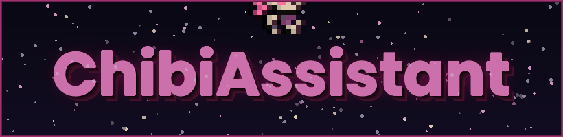
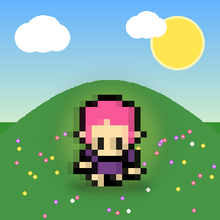
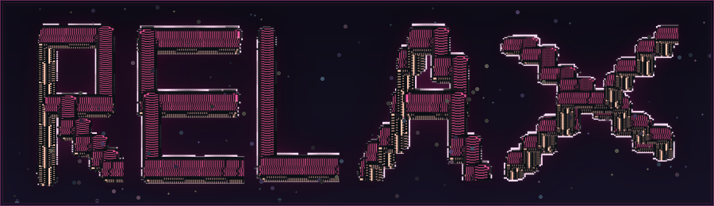

<div align="center">



<br/>

[](https://openjdk.org/)
[](LICENSE)
[]()
[](CONTRIBUTING.md)

<br/>

*A lightweight 2D Java game featuring a chibi character, built for fun and engineered to grow — with an AI-powered feature roadmap coming to life one module at a time.*

</div>

---

## 🌸 Meet Your Companion

<div align="center">
  
</div>

<br/>

ChibiAssistant is a small 2D demo/game written in pure Java. It started as a focused pixel-art tech demo and is growing into a platform for experimenting with AI-driven game features — NPC behavior, procedural content, and an in-game conversational assistant.

No build tools. No bloat. Just `javac`, `java`, and `jar`.

---

## ✨ Features

| Feature | Status |
|---|---|
| 🎮 2D chibi character with sprite rendering | ✅ Live |
| 👻 Ghost Trail Mode — `Z` key echo effect | ✅ Live |
| 🖼️ Custom pixel-art assets | ✅ Live |
| 🗺️ Basic 2D world / scene system | ✅ Live |
| 🤖 AI-powered NPC behavior | 🔜 Planned |
| 🌍 Procedural level generation | 🔜 Planned |
| 💬 In-game conversational assistant | 🔜 Planned |
| 🎨 AI sprite variation & palette generation | 🔜 Planned |
| 🧪 AI-assisted difficulty tuning | 🔜 Planned |

---

## 📁 Project Layout

```
ChibiAssistant/
├── src/
│   └── main/
│       ├── java/
│       │   └── chibiassistant/
│       │       ├── Main.java          ← Entry point
│       │       └── entity/            ← Game entities (player, NPCs, …)
│       └── resources/
│           └── assets/                ← Sprites, tiles, audio
├── releases/
│   └── .gitkeep                       ← Drop built jars here
├── assets/                            ← README images
└── LICENSE
```

---

## ⚙️ Prerequisites

- **JDK 11 or newer** — confirm with:
  ```bash
  java -version
  javac -version
  ```
- No Maven, Gradle, or any external build tool required.

---

## 🛠️ Build, Run & Package

<details>
<summary><b>🐧 Linux / macOS</b></summary>

<br/>

**1 · Compile**
```bash
cd /path/to/ChibiAssistant
find src/main/java -name "*.java" | xargs javac -d out
```

**2 · Run**
```bash
java -cp out chibiassistant.Main
```

**3 · Package into an executable JAR**
```bash
echo "Main-Class: chibiassistant.Main" > manifest.txt
jar cfm releases/chibiassistant-0.1.0.jar manifest.txt \
    -C out . \
    -C src/main/resources .
rm manifest.txt
```

**4 · Run the JAR**
```bash
java -jar releases/chibiassistant-0.1.0.jar
```

</details>

<details>
<summary><b>🪟 Windows (PowerShell)</b></summary>

<br/>

**1 · Compile**
```powershell
cd C:\java\res
javac -d out src\main\java\chibiassistant\*.java src\main\java\chibiassistant\entity\*.java
```

**2 · Run**
```powershell
java -cp out chibiassistant.Main
```

**3 · Package into an executable JAR**
```powershell
echo Main-Class: chibiassistant.Main > manifest.txt
jar cfm releases\chibiassistant-0.1.0.jar manifest.txt -C out . -C src\main\resources .
del manifest.txt
```

**4 · Run the JAR**
```powershell
java -jar releases\chibiassistant-0.1.0.jar
```

</details>

> **💡 Adding new source files?** On Linux, the `find … | xargs javac` pattern picks them up automatically. On Windows, add the new package glob to the `javac` command (e.g. `src\main\java\chibiassistant\ui\*.java`).

> **💡 Resource loading** — code uses `getResourceAsStream("/assets/…")`. The packaging step above bundles `src/main/resources` into the JAR root so all assets resolve correctly at runtime.

---

## 👻 Ghost Trail Mode — The `Z` Key

One of ChibiAssistant's most distinctive features is **Ghost Trail Mode**, toggled with a single keypress.

**How it works:**

- Press **`Z`** once → your chibi begins leaving behind fading echo images of every position it has occupied. As you move, a trail of translucent past-selves lingers on screen — a beautiful, ghostly record of your path through the world.
- Press **`Z`** again → the trail vanishes instantly. Only the current sprite remains, sharp and present, as if the echoes were never there.

There is no in-between state. It is a clean toggle between *presence* and *memory*.

**Why it matters — the Prompting Age perspective:**

We are living in an era where a growing part of creative and technical work means *handing something to an AI and waiting*. You write a prompt, you submit a task, and then — for a few seconds or a few minutes — you exist in a small pocket of unstructured time. Most people reach for their phone. Some stare at a loading bar. Neither is particularly satisfying.

Ghost Trail Mode was designed with exactly that moment in mind. It gives you something tactile, present, and low-stakes to do while a model works in the background. Move your chibi around. Watch the echoes accumulate. There is a quiet rhythm to it — walk, leave traces, watch them fade — that occupies the hands and eyes without demanding the mind. It is the interactive equivalent of doodling in a notebook margin.

**The emotional effect:**

There is something quietly moving about a trail of where you have been. It makes motion feel *meaningful* — every step left an impression, however temporary. Players report that Ghost Trail Mode produces a gentle kind of calm: a softened awareness of time passing, the satisfaction of having moved through space intentionally. The fading echoes serve as a small, visual reminder that *you were here, and now you are somewhere else* — and that both states are fine.

For players who use ChibiAssistant as a background companion while working or prompting, this translates into noticeably lower frustration during wait times. Idle moments become meditative rather than empty. The loop of *prompt → wait → play → return* starts to feel like a natural rhythm rather than an interruption.

> *"The ghost trail doesn't ask anything of you. It just shows you where you've been."*

<div align="center">
  <br/>
  
  <br/>
  <sub><i>Take a breath. Your prompt is still running.</i></sub>
  <br/><br/>
</div>

---

## 🤖 AI Integration Roadmap

ChibiAssistant is designed to evolve. The core game will always run with plain `javac`/`java` — AI features are **opt-in modules** that can be toggled via feature flags or modular class loading.

<br/>

### 🧠 Dynamic NPC Behavior
Replace static scripts with small ML models or rule-based generative systems. NPCs will navigate intelligently, respond to player actions contextually, and carry on natural-feeling dialogue — making the world feel genuinely alive.

### 🌐 Procedural Content Generation
Configurable generators for levels, tile layouts, and item placement. An AI-assisted editor layer will let the game produce fresh environments on every run while respecting authored constraints.

### 💬 Conversational In-Game Assistant
An embedded conversational model available to the player in real time — for hints, lore, adaptive difficulty coaching, or just a friendly chat with your chibi companion.

### 🎨 Asset Variation & Sprite Augmentation
AI-assisted palette swaps, additional pose generation, and sprite augmentation tools. Author control is preserved — the AI proposes; you approve.

### 🧪 Automated Testing & Difficulty Tuning
Lightweight game simulations feed data into parameter optimisers that keep movement speed, jump arcs, and enemy difficulty curves feeling *just right* without manual tweaking.

---

## 🤝 Contributing

Pull requests are welcome! A few guidelines to keep things clean:

- **Keep changes small and focused** — one feature or fix per PR.
- **Document behavior changes** — update this README or inline comments where relevant.
- **AI modules must degrade gracefully** — the core game must remain fully functional when any AI module is absent. Use feature flags or modular loading; never hard-depend on optional components.
- **Pixel art assets** — new sprites should match the existing art style (16×16 or multiples thereof, limited palette).

---

## 📦 Releases

Built JARs go in the `releases/` folder. The repo ships with `releases/.gitkeep` so the directory is tracked without needing an actual artifact committed — drop your built JAR there and it's ready to share.

---

## 📄 License

Distributed under the **MIT License**. See [`LICENSE`](LICENSE) for details.

---

<div align="center">

Made with ☕ and passionate pixels

<sub>ChibiAssistant · Java · MIT</sub>

</div>
